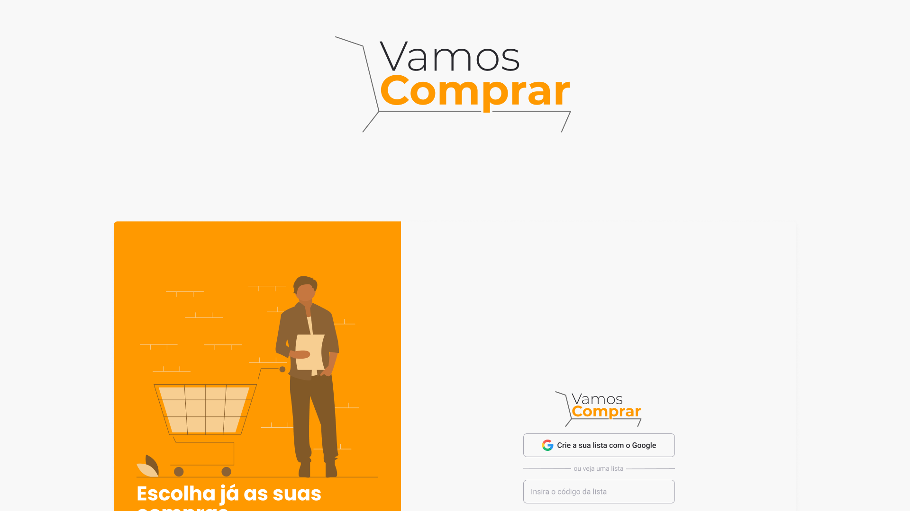

<p align="center">
  
</p>

<h1 align="center">
Vamos Comprar
</h1>

Vamos Comprar é uma aplicação web para gerir a partilhar listas de compras

## Design

Pode encontrar o layout desta aplicação em: [FigmaDesign](https://www.figma.com/file/l8RXPYC8XigYEGUMXolZk3/VamosComprar?node-id=0%3A1)



## Building

É preciso o [Node.js](https://nodejs.org) instalado para fazer build da aplicação.

```bash
git clone https://github.com/nalves599/vamoscomprar.git
$ cd vamoscomprar
$ yarn
$ yarn start
```

Corre a aplicação em desenvolvimento.<br/>
